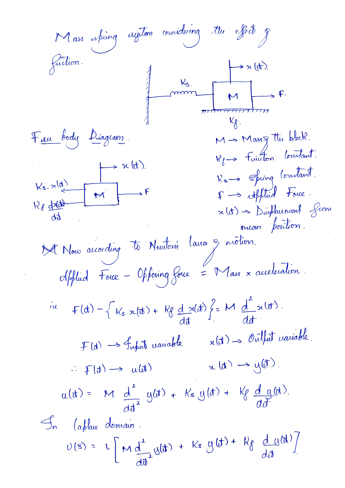
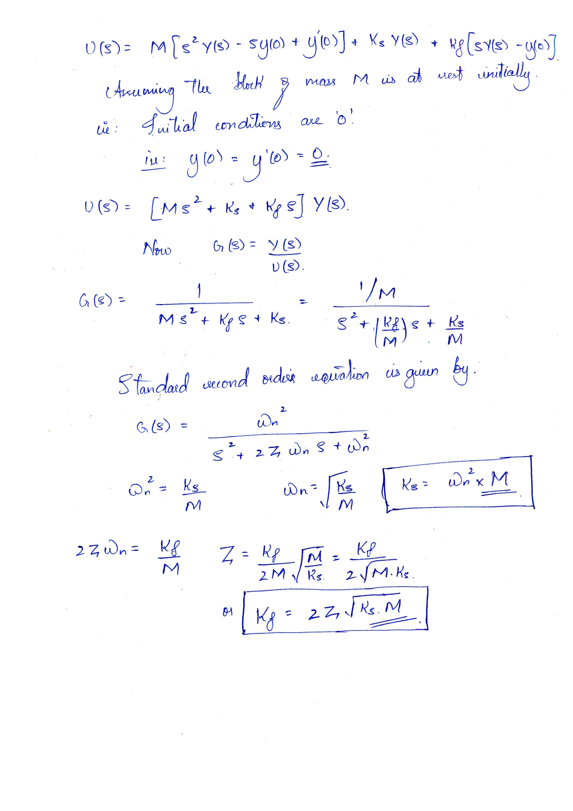
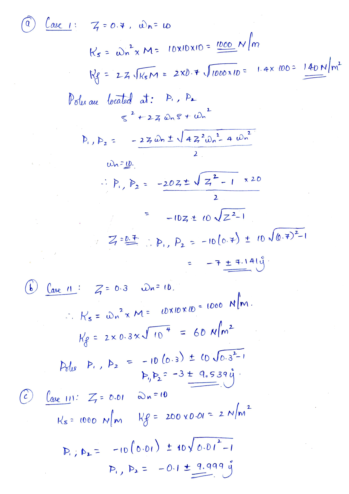
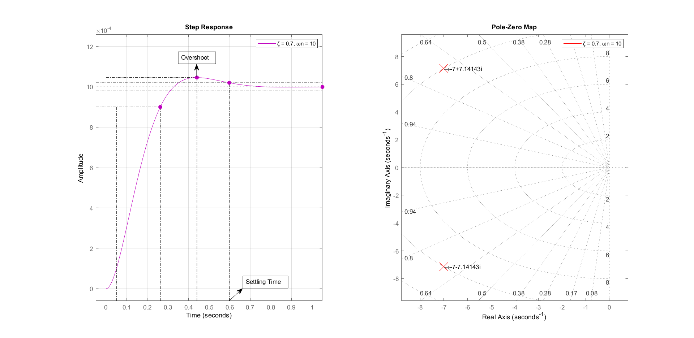
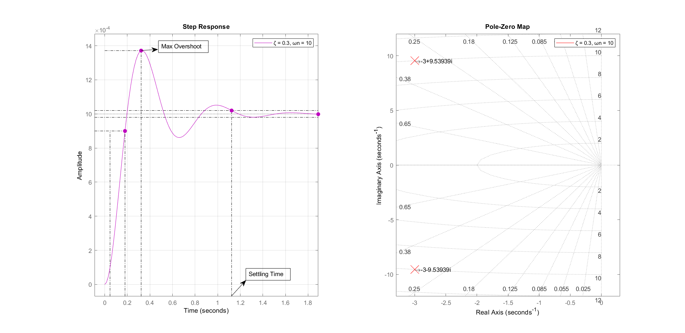
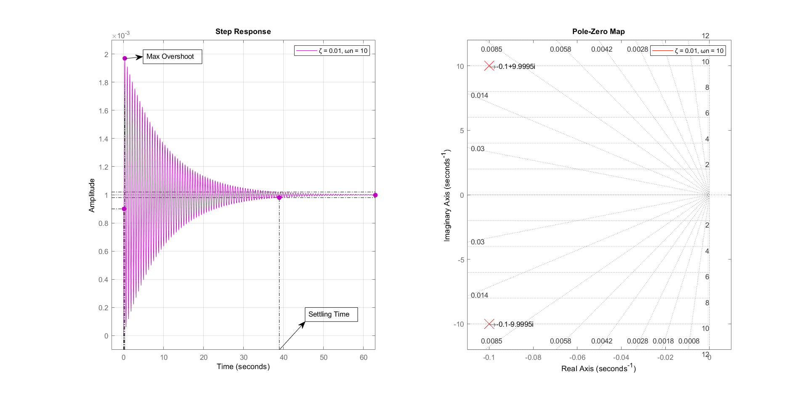

<div style="text-align: center;">
    
        <br>
        <br>
    <h2>A Report on</h2>
    <h1>Problem solving using analytical methods and MATLAB
    </h1>
    <br>
    <br>
    <h2> Submitted for the fulfillment of the CIE (Event-2) for the course</h2>
    <h1>Control Systems - EC540</h1>
    <br>
    <br>
    <br>
    <h3>Submitted by: <br><br>
        <table
            style="margin-left: auto; margin-right: auto; padding: 10px; border: 1px solid black; border-collapse: collapse;">
            <tr>
                <td>Name</td>
                <td>Mohamed Farhan Fazal</td>
            </tr>
            <tr>
                <td>USN</td>
                <td>01JST18EC055</td>
            </tr>
            <tr>
                <td>Roll No.</td>
                <td>29</td>
            </tr>
        </table>
    </h3>
    <br>
    <br>
    <h4>Under the guidance of</h4>
    <h2>Dr. Sudarshan Patilkulkarni</h2>
    <h3>Associate Professor <br>
        DEPARTMENT OF ELECTRONICS AND COMMUNICATION <br>
        SJCE MYSURU- 570006</h3>
</div>

---

<div style="page-break-after: always"></div>


## Problem Statement:
For the mass spring system derive expressions for __ζ__ and __ω<sub>n</sub>__. If __M=10 Kg__, determine
spring and friction constant for following cases: 
1. ζ = 0.7, ωn = 10
2. ζ = 0.3, ωn = 10 
3. ζ = 0.01, ωn = 10

Show the plots for step responses and pole-zero
locations in MATLAB.

--- 
## Solution
- Mass Spring System


- Free Body Diagram


According to Newton's Laws of motion:

<a href="https://www.codecogs.com/eqnedit.php?latex=F(t)&space;-&space;\{K_{s}x(t)&space;&plus;&space;K_{f}\frac{\mathrm{d}&space;x(t)}{\mathrm{d}&space;t}\}&space;=&space;M\frac{\partial^2&space;x(t)}{\partial&space;t^2}" target="_blank"></a>

<a href="https://www.codecogs.com/eqnedit.php?latex=f(t)\Rightarrow&space;u(t)&space;|&space;x(t)&space;\Rightarrow&space;y(t)" target="_blank"></a>

<a href="https://www.codecogs.com/eqnedit.php?latex=u(t)&space;=&space;M\frac{\partial^2&space;y(t)}{\partial&space;t^2}&space;&plus;&space;K_{s}y(t)&space;&plus;&space;K_{f}\frac{\partial&space;y(t)}{\partial&space;t}" target="_blank"></a>

### In Laplace Domain
<a href="https://www.codecogs.com/eqnedit.php?latex=U(S)&space;=&space;[MS^{2}&space;&plus;&space;K_{s}&space;&plus;&space;K_{f}S]\times&space;Y(S)" target="_blank"></a>

<a href="https://www.codecogs.com/eqnedit.php?latex=\frac{Y(S)}{U(S)}&space;=&space;G(S)&space;=&space;\frac{1}{MS^{2}&plus;K_{f}S&plus;K_{s}}" target="_blank"></a>

### Comparing with the Standard Second Order Equation
<a href="https://www.codecogs.com/eqnedit.php?latex=G(S)&space;=&space;\frac{\omega&space;_{n}^{2}}{S^{2}&plus;2\zeta\omega&space;_{n}S&plus;\omega&space;_{n}^{2}}" target="_blank"></a>

<a href="https://www.codecogs.com/eqnedit.php?latex=\omega&space;_{n}&space;=&space;\sqrt{\frac{K_{s}}{M}}" target="_blank"></a> and <a href="https://www.codecogs.com/eqnedit.php?latex=\zeta&space;=&space;\frac{K_{f}}{2\sqrt{K_{s}M}}" target="_blank"></a>

<a href="https://www.codecogs.com/eqnedit.php?latex=K_{s}&space;=&space;\omega&space;_{n}^{2}\times&space;M" target="_blank"></a> and <a href="https://www.codecogs.com/eqnedit.php?latex=K_{f}&space;=&space;2\zeta&space;\times&space;\sqrt{K_{s}\times&space;M}" target="_blank"></a>
### Case 1:
- __M__ = 10 Kg
- __ζ__ = 0.7
- __ω<sub>n</sub>__ = 10
- <a href="https://www.codecogs.com/eqnedit.php?latex=K_{s}&space;=&space;1000&space;N/m" target="_blank"></a>
- <a href="https://www.codecogs.com/eqnedit.php?latex=K_{f}&space;=&space;140&space;N/m^{2}" target="_blank"></a>

### Case 2:
- __M__ = 10 Kg
- __ζ__ = 0.3
- __ω<sub>n</sub>__ = 10
- <a href="https://www.codecogs.com/eqnedit.php?latex=K_{s}&space;=&space;1000&space;N/m" target="_blank"></a>
- <a href="https://www.codecogs.com/eqnedit.php?latex=K_{f}&space;=&space;140&space;N/m^{2}" target="_blank"></a>

### Case 3:
- __M__ = 10 Kg
- __ζ__ = 0.01
- __ω<sub>n</sub>__ = 10
- <a href="https://www.codecogs.com/eqnedit.php?latex=K_{s}&space;=&space;1000&space;N/m" target="_blank"></a>
- <a href="https://www.codecogs.com/eqnedit.php?latex=K_{f}&space;=&space;140&space;N/m^{2}" target="_blank"></a>

---
<div style="page-break-after: always"></div>


## Derivation and Calculations

<div style="page-break-after: always"></div>



<div style="page-break-after: always"></div>



<div style="page-break-after: always"></div>

# MATLAB CODE
## Main Code | [solution.m](./code/solution.m)
```MATLAB
clear all;
close all;
clc;

% DECLARING CONSTANTS STATICALLY
% frictionConstant = [140 60 2];
% springConstant = 1000;

% MORE DYNAMIC CONSTANT CALCULATION
massOfBlock = 10;
zetaValues = [0.7, 0.3, 0.01];
naturalFrequency = 10;

springConstant = naturalFrequency^2 * massOfBlock;
frictionConstant = 2*zetaValues*sqrt(springConstant*massOfBlock);

for index = 1:length(frictionConstant)
    figure;
    G = tf([1], [massOfBlock frictionConstant(index) springConstant]);
    response = stepplot(G, "m");
    grid on;
    legend(strcat("ζ = ", num2str(zetaValues(index)), ", ωn = 10"));
    disp(strcat("Time Domain Parameters of transfer function with ", "ζ = ", num2str(zetaValues(index)), ", ωn = 10"))
    disp(stepinfo(G));

    response.showCharacteristic('PeakResponse');
    response.showCharacteristic('RiseTime');
    response.showCharacteristic('SettlingTime');
    response.showCharacteristic('SteadyState');

    setAxisLimits(axis);
end
```

<div style="page-break-after: always"></div>

## Helper Snippets
1. [setAxisLimits.m](./code/setAxisLimits.m)
```MATLAB
% THIS SNIPPET IS TO ADD PADDING TO THE PLOT

function setAxisLimits(axisData, padding)
    % RELATIVE TO THE OVERALL PLOT
    % 0.1 IS 10% AND 0.5 IS 50%

    arguments
        axisData;
        padding = 0.05; % PADDING DEFALUTS TO 5%
    end

    axisLength = axisData(2) - axisData(1);
    axisHeight = axisData(4) - axisData(3);
    axis([axisData(1) - padding * axisLength axisData(2) + padding * axisLength axisData(3) - padding * axisHeight axisData(4) + padding * axisHeight]);
end
```
2. [labelOnPlot.m](./code/labelOnPlot.m)
```MATLAB
function labelOnPlot(A)
    text(real(A(1)), imag(A(1)), strcat("\rightarrow",num2str(A(1))));
    text(real(A(2)), imag(A(2)), strcat("\rightarrow",num2str(A(2))));
end
```

---

<div style="page-break-after: always"></div>

# RESULTS
## Command Window Output

```MATLAB
G =
            1
  ---------------------
  10 s^2 + 140 s + 1000
 
Continuous-time transfer function.

Time Domain Parameters of transfer function with ζ = 0.7, ωn = 10
        RiseTime: 0.2127
    SettlingTime: 0.5979
     SettlingMin: 9.0010e-04
     SettlingMax: 0.0010
       Overshoot: 4.5986
      Undershoot: 0
            Peak: 0.0010
        PeakTime: 0.4408


G =
           1
  --------------------
  10 s^2 + 60 s + 1000
 
Continuous-time transfer function.

Time Domain Parameters of transfer function with ζ = 0.3, ωn = 10
        RiseTime: 0.1324
    SettlingTime: 1.1230
     SettlingMin: 8.6139e-04
     SettlingMax: 0.0014
       Overshoot: 37.1410
      Undershoot: 0
            Peak: 0.0014
        PeakTime: 0.3224


G =
           1
  -------------------
  10 s^2 + 2 s + 1000
 
Continuous-time transfer function.

Time Domain Parameters of transfer function with ζ = 0.01, ωn = 10
        RiseTime: 0.1050
    SettlingTime: 38.9674
     SettlingMin: 6.0902e-05
     SettlingMax: 0.0020
       Overshoot: 96.9071
      Undershoot: 0
            Peak: 0.0020
        PeakTime: 0.3142
```
<div style="page-break-after: always"></div>

## Plots
### Case 1 Plot


---

### Case 2 Plot


---

<div style="page-break-after: always"></div>

### Case 3 Plot


---


## Conclusion/Inference
From the above results and observations, we can conclude the following
- The system in all the 3 cases is __stable__ as the poles of the system in all the 3 cases are to the ___left___ of the Imaginary Axis on the ___S-plane___
- Friction co-efficient <a href="https://www.codecogs.com/eqnedit.php?latex=\bg_white&space;K_{f}" target="_blank"></a> is directly proportial to ζ , hence as ζ decreses, <a href="https://www.codecogs.com/eqnedit.php?latex=\bg_white&space;K_{f}" target="_blank"></a> also decreases.
- As the value of friction co-efficient decreses, that is when the effect of friction decreases ,the number of oscillations increses, which means, there is an increase in the __settling time__, and also the __maximum overshoot__ is relatively ___higher___ as seen in case 3 with ___ζ=0.01___.