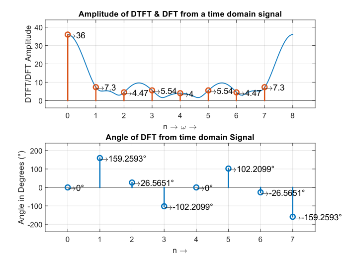
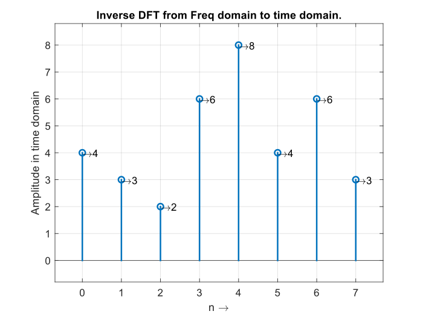

 ### DFT | DTFT | IDFT

Calculating DTFT, DFT and IDFT

## DFT and DTFT
- Input Sequence: `4 3 2 6 8 4 6 3`

```MATLAB
Enter the Sequence in time domain: [4 3 2 6 8 4 6 3]

ans = 

    "Calculated using manually coded function"


ans =

  36.0000 + 0.0000i
  -6.8280 + 2.5860i
   4.0000 + 2.0000i
  -1.1720 - 5.4140i
   4.0000 + 0.0000i
  -1.1720 + 5.4140i
   4.0000 - 2.0000i
  -6.8280 - 2.5860i


ans = 

    "Calculated using builtin coded function"


ans =

  36.0000 + 0.0000i
  -6.8280 + 2.5860i
   4.0000 + 2.0000i
  -1.1720 - 5.4140i
   4.0000 + 0.0000i
  -1.1720 + 5.4140i
   4.0000 - 2.0000i
  -6.8280 - 2.5860i
```


## IDFT

- Input Sequence: 
```MATLAB
  36.0000 + 0.0000i
  -6.8280 + 2.5860i
   4.0000 + 2.0000i
  -1.1720 - 5.4140i
   4.0000 + 0.0000i
  -1.1720 + 5.4140i
   4.0000 - 2.0000i
  -6.8280 - 2.5860i
  ```
