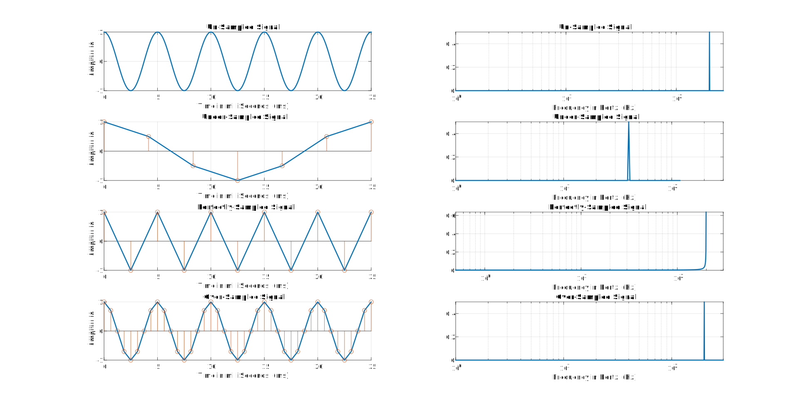

# DSP EC550 Lab Experiment 1

    <h2>Verification of Nyquist's Sampling Theorem</h2>

    <h2>Question</h2>

- Write a MATLAB code to illustrate the Nyquist sampling theorem. The program should illustrate the effects the sampling the signal at 
    - Exactly the folding frequency
    - Frequency less than the folding frequency
    - Frequency greater than the folding frequency

    Plot the magnitude spectrum for all the above said cases 
- Write a MATLAB code to compute the DTFT and DFT of a sequence x (n). Also plot the magnitude spectrum of both DTFT and DFT and provide the inference on the basis of results obtained. Further compute the IDFT.

***

    <h2>Solution</h2>

### Part 1

In order to represent an analog signal x(t) by a discrete-time signal x(n) accurately,  the analog signal can be exactly reconstructed back from the discrete-time signal, the sampling frequency fs must be at least twice the maximum frequency component (fm) of the original analog signal. Thus we have, 
 - fs ≥ 2 * fm

The minimum sampling rate is called the Nyquist rate and the above Sampling Theorem is called the Shannon's Sampling Theorem.

Under Sampling 
- fs ≤ 2 * fm

Perfect Sampling
 - fs = 2 * fm

 Over Sampling
 - fs >> 2 * fm

Output of v2Sampling.m with an input of 200 Hz. <a href="./v2sampling.m">Download v2sampling.m</a>

 

    
 
