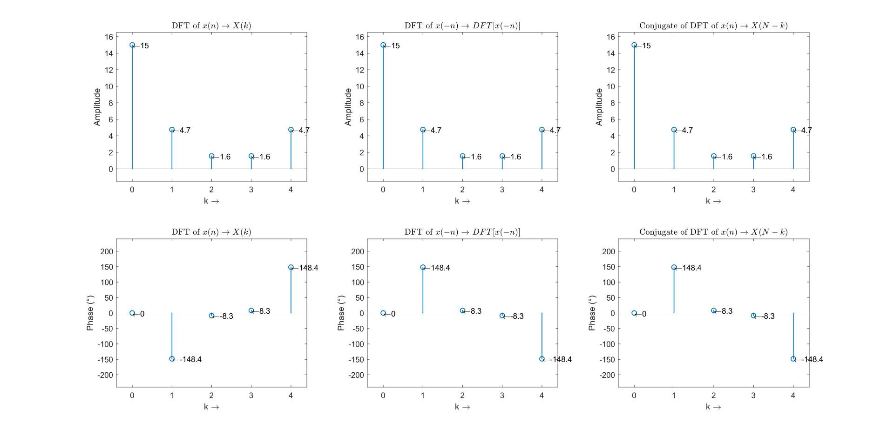

### Run the following files

1. Time Reversal Property
    - [verifyTimeReversal.m](./verifyTimeReversal.m)

    Input Sequence: __[2 3 5 4 1]__
    ```MATLAB
    Enter the sequence: [2 3 5 4 1]
    DFT of x(n) is: 
      15.0000 + 0.0000i  -4.0450 - 2.4900i   1. 5450 - 0.2250i   1.5450 + 0.2250i  -4.0450   + 2.4900i
    
    The time reversed sequence x(-n) is: 
         2     1     4     5     3
    
    DFT of time reversed sequence x(-n) is: 
      15.0000 + 0.0000i  -4.0450 + 2.4900i   1. 5450 + 0.2250i   1.5450 - 0.2250i  -4.0450   - 2.4900i
    
    Conjugate of X(k) is: 
      15.0000 + 0.0000i  -4.0450 + 2.4900i   1. 5450 + 0.2250i   1.5450 - 0.2250i  -4.0450   - 2.4900i
    
    The DFT of time reversed sequence is equal  to the conjugate of x(n)
    Thus the time reversal property is verified.
    ```



---

2. Parsevals Theorem
    - [verifyParsevalsTheorem.m](./verifyParsevalsTheorem.m)
    
    __Output__:

    ```MATLAB
    Enter the sequence: [2 3 5 4 1]
    Energy in time domain is: 
        55

    Energy in freq domain is: 
        55

    Thus the Parseval's theorem is verified...!
    ```

3. Circular Convolution using Linear
    - [circularConvolutionUsingLinear.m](./circularConvolutionUsingLinear.m)

    __Output__:
    ```MATLAB
    Enter the sequence 1: [1 2 3 4 5]
    Enter the sequence 2: [6 7 8]
    Circular Convolution using Linear Convolution is: 
        73    59    40    61    82
    ```
4. Linear Convolution using Circular
    - [linearConvolutionUsingCircular.m](./linearConvolutionUsingCircular.m)

    __Output__:
    ```MATLAB
    Enter the first sequence: [1 2 3 4 5]
    Enter the second sequence: [6 7 8]
    Linear Convolution calculated using Circular Convolution is: 
        6    19    40    61    82    67    40
    ```

---

## __Note__:

* Make sure that all the files in this directory are in the same folder when executing the matlab files.
