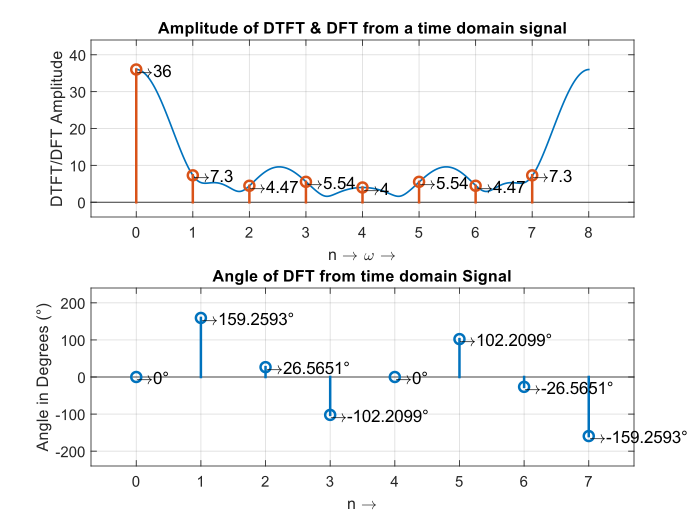
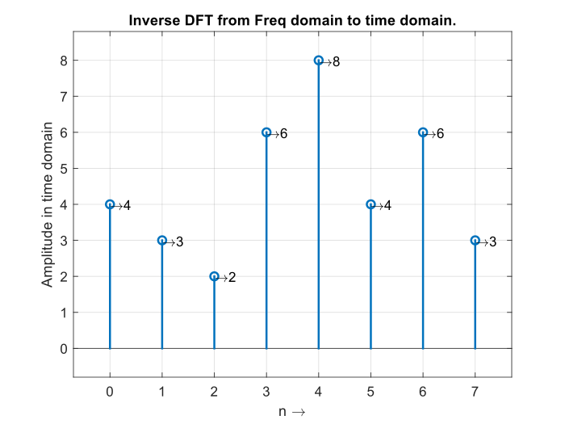

<h1 style="text-align:center;">EC57L DSP - LAB</h1>
<h2 style="text-align:center;">Lab Experiments' Report</h2>
<hr>

## Experiment 1: Sampling Theorem
#### Sampling in Virtual Lab IIT-K
- Effect of Under Sampling


- Effect of Perfect Sampling


#### Sampling in MATLAB
Code:
```MATLAB
% THIS IS THE VERISON 2 OF THE EXPERIMENT 1 - VERIFICATION OF THE NYQUIST'S THEOREM FOR SAMPLING
% AUTHOR: MOHAMED FARHAN FAZAL

clear all;
close all;
clc;
% Clearing the Workspace and Command Window

% Initiallizing the Variables

widthOfTheLine = 1.5;
numberOfWaves = 5; % Number of waveforms to be shown
messageSignalFrequency = input("Enter the Message Signal Frequency: "); % Taking the user's input for Message Signal Frequency
initialSamplingFreq = 50*messageSignalFrequency; % Sampling Frequency for Unsampled Signal
timePerSample = 1/initialSamplingFreq; % Time needed for a single sample
stopTime = 1; % Samples to be generated up to.
timeAxis = 0:timePerSample:stopTime-timePerSample; % Generating the time axis
totalNumberOfSamples = size(timeAxis,2); % Calculating the number of samples
samplingFrequencyInterval = initialSamplingFreq/totalNumberOfSamples; % Calculating the frequency interval to generate the frequency axis;
frequencyAxis = -initialSamplingFreq/2:samplingFrequencyInterval:initialSamplingFreq/2-samplingFrequencyInterval; % Generating the Frequency Axis
phiDegrees = 90; % in degrees

phi = phiDegrees * pi / 180;


% Plotting the Unsampled Signal
% In time Domain
subplot(421);
xData = sin(2*pi*messageSignalFrequency*timeAxis + phi);
plot(1000*timeAxis, xData, "lineWidth", widthOfTheLine);
set(get(gca, 'XLabel'), 'String', 'Time in milliSeconds  (ms)');
set(get(gca, 'YLabel'), 'String', 'Amplitude');
set(get(gca, 'Title'), 'String', 'Un-Sampled Signal');
grid on;
axis([0 1000*numberOfWaves/messageSignalFrequency -1 1]);

% In Frequency Domain
subplot(422);
xDataFFT = fftshift(fft(xData));
semilogx(frequencyAxis, abs(xDataFFT)/totalNumberOfSamples, "lineWidth", widthOfTheLine);
set(get(gca, 'XLabel'), 'String', 'Frequency in Hertz  (Hz)');
set(get(gca, 'Title'), 'String', 'Un-Sampled Signal');
grid on;
axis([0 messageSignalFrequency+messageSignalFrequency/3 0 inf]);


% Plotting Under Sampled Signal

underSamplingFrequency = 1.2*messageSignalFrequency; % Deciding the Frequency for demonstraring undersampling
under_timePerSample = 1/underSamplingFrequency; % Time needed for a single sample
under_timeAxis = 0:under_timePerSample:stopTime-under_timePerSample; % Generating the time axis
under_totalNumberOfSamples = size(under_timeAxis,2); % Calculating the number of samples
under_samplingFrequencyInterval = underSamplingFrequency/under_totalNumberOfSamples; % Calculating the frequency interval to generate the frequency axis;
under_frequencyAxis = -underSamplingFrequency/2:under_samplingFrequencyInterval:underSamplingFrequency/2-under_samplingFrequencyInterval; % Generating the Frequency Axis

% In time Domain
subplot(423);
under_xData = sin(2*pi*messageSignalFrequency*under_timeAxis + phi);
hold on;
plot(1000*under_timeAxis, under_xData, "lineWidth", widthOfTheLine);
stem(1000*under_timeAxis, under_xData);
set(get(gca, 'XLabel'), 'String', 'Time in milliSeconds  (ms)');
set(get(gca, 'YLabel'), 'String', 'Amplitude');
set(get(gca, 'Title'), 'String', 'Under-Sampled Signal');
hold off;
grid on;
axis([0 1000*numberOfWaves/messageSignalFrequency -1 1]);

% In Frequency Domain
subplot(424);
under_xDataFFT = fftshift(fft(under_xData));
semilogx(under_frequencyAxis, abs(under_xDataFFT)/under_totalNumberOfSamples, "lineWidth", widthOfTheLine);
set(get(gca, 'XLabel'), 'String', 'Frequency in Hertz  (Hz)');
set(get(gca, 'Title'), 'String', 'Under-Sampled Signal');
grid on;
axis([0 messageSignalFrequency+messageSignalFrequency/2 0 inf]);


% Plotting Perfect Sampled Signal

perfectSamplingFrequency = 2*messageSignalFrequency; % Deciding the Frequency for demonstraring perfectsampling
perfect_timePerSample = 1/perfectSamplingFrequency; % Time needed for a single sample
perfect_timeAxis = 0:perfect_timePerSample:stopTime; % Generating the time axis %removed "-perfect_timePerSample"
perfect_totalNumberOfSamples = size(perfect_timeAxis,2); % Calculating the number of samples
perfect_samplingFrequencyInterval = perfectSamplingFrequency/perfect_totalNumberOfSamples; % Calculating the frequency interval to generate the frequency axis;
perfect_frequencyAxis = -perfectSamplingFrequency/2:perfect_samplingFrequencyInterval:perfectSamplingFrequency/2-perfect_samplingFrequencyInterval; % Generating the Frequency Axis

% In time Domain
subplot(425);
perfect_xData = sin(2*pi*messageSignalFrequency*perfect_timeAxis + phi);
hold on;
plot(1000*perfect_timeAxis, perfect_xData, "lineWidth", widthOfTheLine);
stem(1000*perfect_timeAxis, perfect_xData);
set(get(gca, 'XLabel'), 'String', 'Time in milliSeconds  (ms)');
set(get(gca, 'YLabel'), 'String', 'Amplitude');
set(get(gca, 'Title'), 'String', 'Perfectly-Sampled Signal');
hold off;
grid on;
axis([0 1000*numberOfWaves/messageSignalFrequency -1 1]);

% In Frequency Domain
subplot(426);
perfect_xDataFFT = fftshift(fft(perfect_xData));
semilogx(perfect_frequencyAxis, abs(perfect_xDataFFT)/perfect_totalNumberOfSamples, "lineWidth", widthOfTheLine);
set(get(gca, 'XLabel'), 'String', 'Frequency in Hertz  (Hz)');
set(get(gca, 'Title'), 'String', 'Perfectly-Sampled Signal');
grid on;
axis([0 messageSignalFrequency+messageSignalFrequency/2 0 inf]);


% Plotting Over Sampled Signal

overSamplingFrequency = 8*messageSignalFrequency; % Deciding the Frequency for demonstraring oversampling
over_timePerSample = 1/overSamplingFrequency; % Time needed for a single sample
over_timeAxis = 0:over_timePerSample:stopTime-over_timePerSample; % Generating the time axis
over_totalNumberOfSamples = size(over_timeAxis,2); % Calculating the number of samples
over_samplingFrequencyInterval = overSamplingFrequency/over_totalNumberOfSamples; % Calculating the frequency interval to generate the frequency axis;
over_frequencyAxis = -overSamplingFrequency/2:over_samplingFrequencyInterval:overSamplingFrequency/2-over_samplingFrequencyInterval; % Generating the Frequency Axis

% In time Domain
subplot(427);
over_xData = sin(2*pi*messageSignalFrequency*over_timeAxis + phi);
hold on;
plot(1000*over_timeAxis, over_xData, "lineWidth", widthOfTheLine);
stem(1000*over_timeAxis, over_xData);
set(get(gca, 'XLabel'), 'String', 'Time in milliSeconds  (ms)');
set(get(gca, 'YLabel'), 'String', 'Amplitude');
set(get(gca, 'Title'), 'String', 'Over-Sampled Signal');
hold off;
grid on;
axis([0 1000*numberOfWaves/messageSignalFrequency -1 1]);

% In Frequency Domain
subplot(428);
over_xDataFFT = fftshift(fft(over_xData));
semilogx(over_frequencyAxis, abs(over_xDataFFT)/over_totalNumberOfSamples, "lineWidth", widthOfTheLine);
set(get(gca, 'XLabel'), 'String', 'Frequency in Hertz  (Hz)');
set(get(gca, 'Title'), 'String', 'Over-Sampled Signal');
grid on;
axis([0 messageSignalFrequency+messageSignalFrequency/2 0 inf]);

% Clearing the Workspace and the Command Window
clear all;
clc;
```

#### Results


## Experiment 2: DFT, IDFT, DTFT
Code:
1. dft.m
```MATLAB
function DFT = dft(sequence)

sequenceLength = length(sequence);
twiddleFactorMatrix = twiddleFactor(sequenceLength);
DFT = twiddleFactorMatrix*sequence.';
    
end
```
2. dtft.m
```MATLAB
function [DTFT dtftPointLength] = dtft(sequence)
    sequenceLength = length(sequence);
    dtftPointLength = 1000;
    DTFT = dft([sequence zeros(1,dtftPointLength-sequenceLength)]);
end
```
3. idft.m
```MATLAB
function IDFT = idft(sequence)
    IDFT = conj(dft(conj(sequence.')))/length(sequence);
end
```
4. setAxisLimits.m
```MATLAB
function setAxisLimits(axisData)
    padding = 0.1; % Relative to the overall output
    axisLength = axisData(2) - axisData(1);
    axisHeight = axisData(4) - axisData(3);
    axis([axisData(1) - padding * axisLength axisData(2) + padding * axisLength axisData(3) - padding * axisHeight axisData(4) + padding * axisHeight]);
end
```
5. setPlotAttributes.m
```MATLAB
function setPlotAttributes(xAxisLabel, yAxisLabel, plotTitle)
    set(get(gca, 'XLabel'), 'String', xAxisLabel);
    set(get(gca, 'YLabel'), 'String', yAxisLabel);
    set(get(gca, 'Title'), 'String', plotTitle);
end
```
6. twiddleFactor.m
```MATLAB
function twiddleMatrix = twiddleFactor(sequenceLenght, needMatrix)
    %arguments
    %sequenceLenght
    %needMatrix = 1;
    %end
    needMatrix = 1;
    twiddleMatrix = complex(ones([sequenceLenght sequenceLenght]));
    theta = 2 * pi / sequenceLenght;

    for index1 = 2:sequenceLenght
        for index2 = 2:sequenceLenght
            twiddleMatrix(index1, index2) = cos(theta * (index2 - 1) * (index1 - 1)) - i * sin(theta * (index2 - 1) * (index1 - 1));
        end
    end

    if ~needMatrix
        twiddleMatrix = twiddleMatrix(:, 2);
    end
```
#### Results
## DFT and DTFT
- Input Sequence: `4 3 2 6 8 4 6 3`

```MATLAB
Enter the Sequence in time domain: [4 3 2 6 8 4 6 3]

ans = 

    "Calculated using manually coded function"


ans =

  36.0000 + 0.0000i
  -6.8280 + 2.5860i
   4.0000 + 2.0000i
  -1.1720 - 5.4140i
   4.0000 + 0.0000i
  -1.1720 + 5.4140i
   4.0000 - 2.0000i
  -6.8280 - 2.5860i


ans = 

    "Calculated using builtin coded function"


ans =

  36.0000 + 0.0000i
  -6.8280 + 2.5860i
   4.0000 + 2.0000i
  -1.1720 - 5.4140i
   4.0000 + 0.0000i
  -1.1720 + 5.4140i
   4.0000 - 2.0000i
  -6.8280 - 2.5860i
```


## IDFT

- Input Sequence: 
```MATLAB
  36.0000 + 0.0000i
  -6.8280 + 2.5860i
   4.0000 + 2.0000i
  -1.1720 - 5.4140i
   4.0000 + 0.0000i
  -1.1720 + 5.4140i
   4.0000 - 2.0000i
  -6.8280 - 2.5860i
  ```
