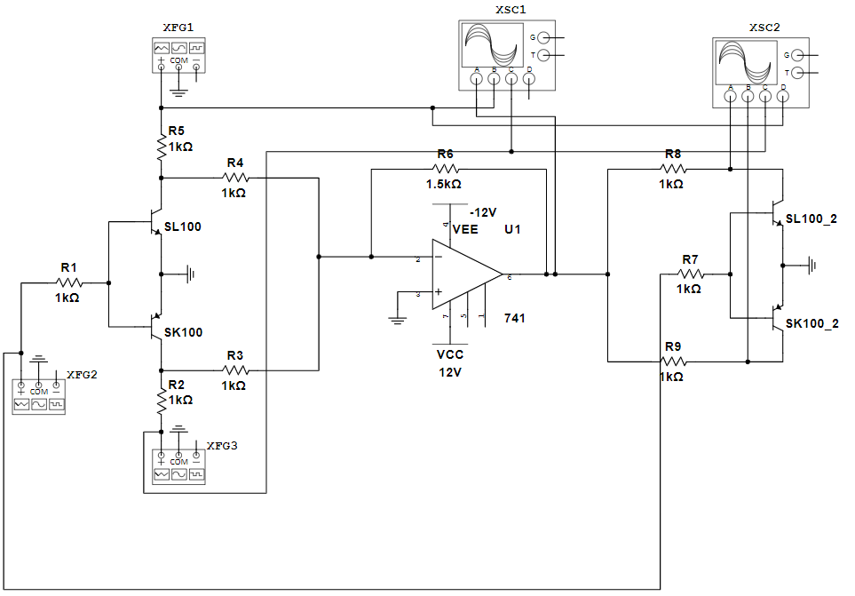
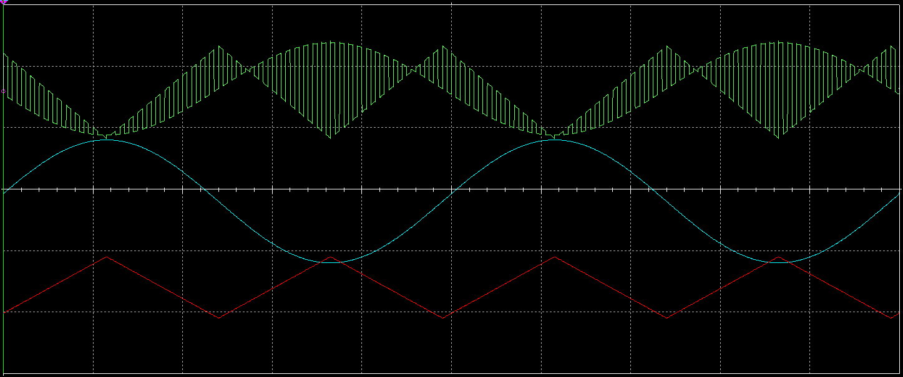
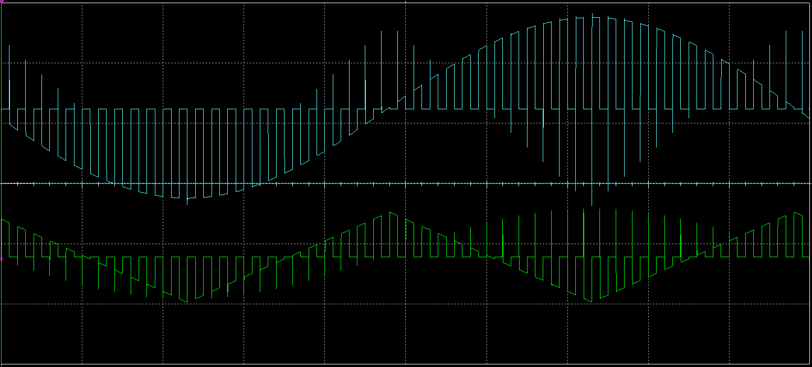
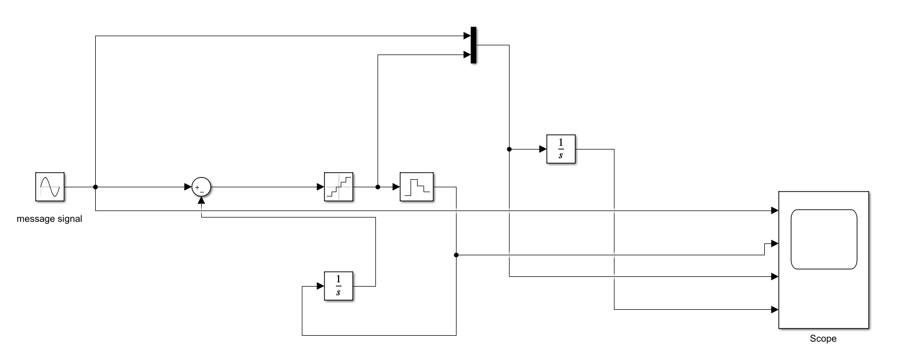
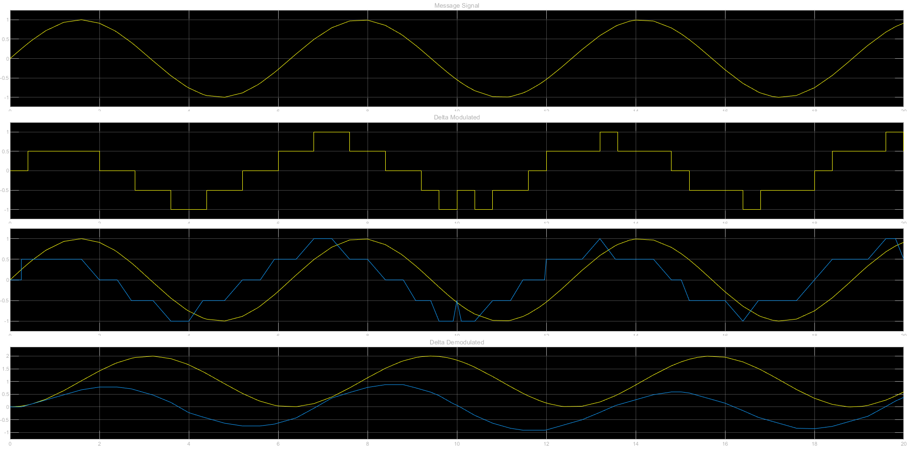

<h1 style="text-align:center;">TDM - Time Division Multiplexing</h1>

### Software Used: __Multisim__

### Circuit:

### Plots:
#### Multiplexed

#### De-Multiplexed

---

<h1 style="text-align:center;">DM - Delta Modulation</h1>

### Software Used: __Simulink__

### Model:

### Plot:
